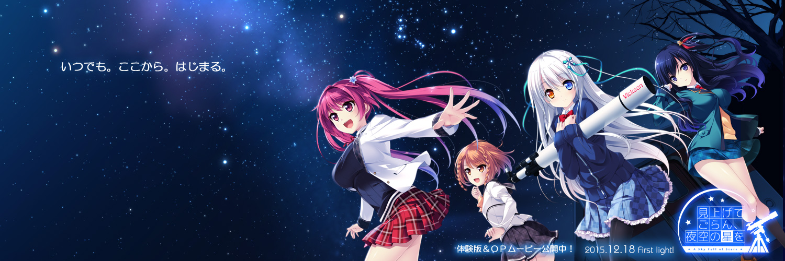

# :mega: Welcome to SeaotterMS home :mega:

## :star2: My Language

More Details(Time)

  
It is now my main language, amost a year  
  
It is also my main language, amost **four** year  
  
Used at work, amost a year  
  
It is also my main language, amost a year  
  
It is also my main language, amost a year  
  
Amost a year  
  
Maybe a few weeks  
  
Maybe a few weeks  
  
Maybe a few weeks  
  
Maybe a few days  
  
Maybe a few weeks  
  
Maybe a few weeks  
  
amost a few weeks(I hate this language)  
  
Maybe a few days

## :microscope: Other Techonology

## :bookmark_tabs: Now i learning

## :bar_chart: activity graph/cards

  

<!--  -->
